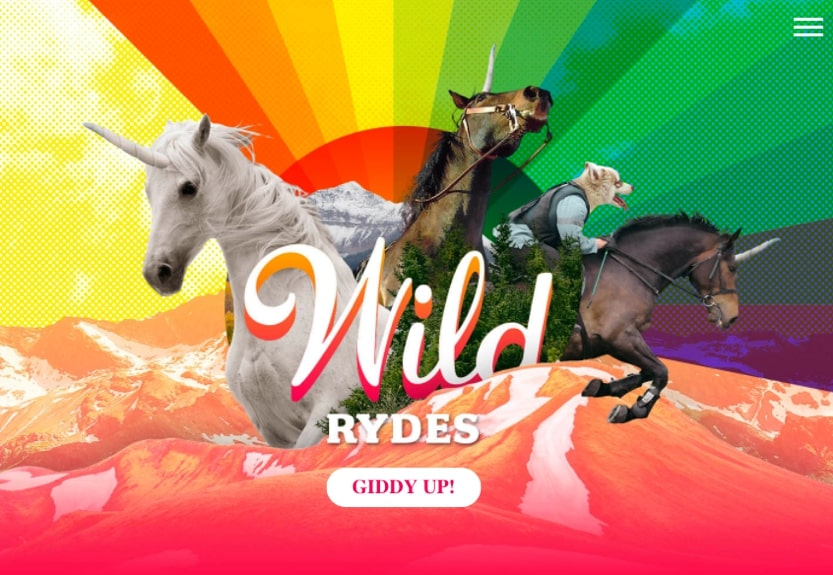

# Data Analyst

## Education
* M.S., Data Science and Analytics, Universiti Sains Malaysia (USM), 2019-2021
* B.S., Statistical Computing and Operations Research, Universiti Tunku Abdul Rahman (UTAR), 2014-2017

## Certifications
* Microsoft Power BI Data Analyst
* INTEL AI Academy
* CIMB Data Science Challenge 2016

## Technical Skills & Stacks
* **Programming Languages:** Python, R, SQL
* **Statistical Analysis & ML Tools:** Excel, SPSS, Minitab, Weka, RapidMiner
* **Data Collection:** Web Scraping (Beautiful Soup, Scrapy, Selenium)
* **Data Querying:** SQL Server Management Studio
* **Data Cleaning & Transformation:** Excel, Python
* **Data Manipulation & Analysis:** Pandas, Numpy
* **Data Visualization:** Matplotlib, Seaborn, Power BI, Tableau, MicroStrategy
* **ML Skills:** Classification, Outlier Detection, Recommender System, Sentiment Analysis
* **Deployment:** Streamlit
* **IDEs & Text Editors:** Jupyter Notebook, Microsoft Visual Studio, RStudio, PyCharm

# [Project 1: AWS Wild Rydes Web Application](https://master.ddxhjbawnsgzo.amplifyapp.com)

A sample application that showcases how different AWS services can be used together to build an end-to-end modern, scalable, and secure web application. AWS services used include CodeCommit, Identity & Access Management (IAM), Amplify, Cognito, Lambda, API Gateway, and DynamoDB. View the applicaiton at <https://master.ddxhjbawnsgzo.amplifyapp.com>.

# [Project 2: Sentiment Analysis on U.S Airline Tweets](https://github.com/issacdtjs/Sentiment-Analysis)

Photo by <a href="https://unsplash.com/@thepuzzlers_damian?utm_content=creditCopyText&utm_medium=referral&utm_source=unsplash">Damian Hutter</a> on <a href="https://unsplash.com/photos/two-american-airlines-planes-on-airport-4jUK5aiSNPM?utm_content=creditCopyText&utm_medium=referral&utm_source=unsplash">Unsplash</a>

This project conducted sentiment analysis on a dataset – U.S airline tweets retrieved from [Kaggle](https://www.kaggle.com/datasets/tango911/airline-sentiment-tweets). A comparison between Lexicon-based approach, particularly TextBlob and Vader, with machine learning-based classifiers like Naïve Bayes, Random Forest, Logistic Regression, and Support Vector Machine.
* **Python libraries used:** Pandas, Matplotlib, Wordcloud, Natural Language Toolkit (NLTK), Textblob, Vader
* **Input:** Tweets
* **Output:** Sentiment of Tweets

#### Model Deploy as Web App:
<https://sentiment-analysis-tweets.streamlit.app/>

#### Project Source Code: 

# [Project 3: Anomaly Detection of Carbon Dioxide Flux using Unsupervised Outlier Detection Algorithms](https://github.com/issacdtjs/Outlier-Detection)

Photo by <a href="https://unsplash.com/@tylercaseyprod?utm_content=creditCopyText&utm_medium=referral&utm_source=unsplash">Tyler Casey</a> on <a href="https://unsplash.com/photos/white-windmill-during-daytime-ficbiwfOPSo?utm_content=creditCopyText&utm_medium=referral&utm_source=unsplash">Unsplash</a>

This project aims to compare different unsupervised outlier detection algorithms using a dataset to identify anomalies in carbon dioxide flux. Candidate models considered include k-Nearest Neighbor Global (k-NN Global), Local Outlier Factor (LOF), Density-based Spatial Clustering of Application with Noise (DBSCAN), Isolation Forest (IF), and One-Class Support Vector Machine (OC-SVM).

The best model in terms of area under the curve receiver operating characteristic (AUC-ROC) hence will integrate into the client’s system for detection of future anomalous carbon dioxide flux. Flux data are measured and collected using the Eddy Covariance (EC) approach that has been set up at the Centre for Marine and Coastal Studies (CEMACS), Penang, Malaysia. View more at website: <http://atmosfera.usm.my/>.

#### Project Source Code
#### Statistical-based labeling:

#### Quality Expert Opinion labeling:

# [Project 4: Music Genre Classification for Spotify Tracks](https://github.com/issacdtjs/Music-Genre-Classification)

Photo by <a href="https://unsplash.com/@thibaultpenin?utm_content=creditCopyText&utm_medium=referral&utm_source=unsplash">Thibault Penin</a> on <a href="https://unsplash.com/photos/a-person-holding-a-laptop-in-the-dark-b5ioGEe8j04?utm_content=creditCopyText&utm_medium=referral&utm_source=unsplash">Unsplash</a>

This project focus on classification of the Spotify tracks into their respective music genre by looking at the spotify features such as valence, danceability, energy, acousticness, speechiness and others. Algorithms used for modeling include K-Nearest Neighbors (KNN), Naïve Bayes, and Neural Network (multi-layer Perceptron). Dataset used are retrieved from [Kaggle](https://www.kaggle.com/datasets/zaheenhamidani/ultimate-spotify-tracks-db).
* **Python libraries used:** Pandas, Numpy, Matplotlib, Seaborn, Scikit-learn
* **Input:** Spotify Tracks
* **Output:** Music Genre

#### Project Source Code:

